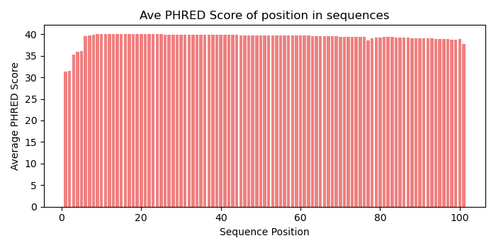
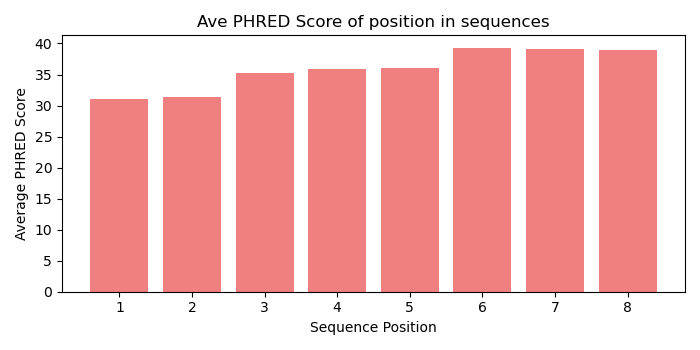
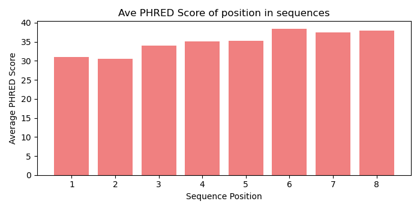
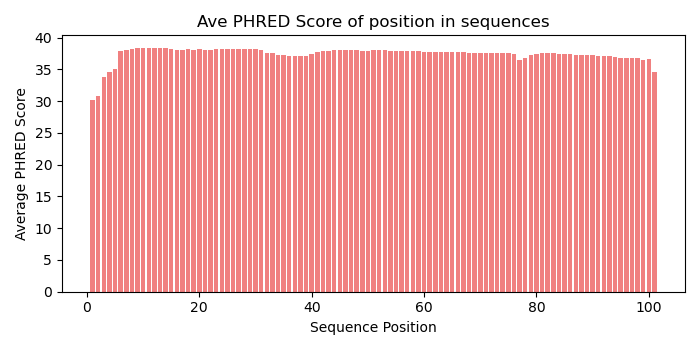

# Assignment the First

## Part 1
1. Be sure to upload your Python script. Provide a link to it here:

[perbase_dist.py](perbase_dist.py)


| File name                    | label  | Read length | Phred encoding |
| ---------------------------- | ------ | ----------- | -------------- |
| 1294_S1_L008_R1_001.fastq.gz | Read1  | 101         | 33             |
| 1294_S1_L008_R2_001.fastq.gz | Index1 | 8           | 33             |
| 1294_S1_L008_R3_001.fastq.gz | Index2 | 8           | 33             |
| 1294_S1_L008_R4_001.fastq.gz | Read2  | 101         | 33             |
2. Per-base NT distribution
    1. Use markdown to insert your 4 histograms here.

    R1:
    
    

    R2:
    
    
    
    R3:
    
    

    R4:
    
    
    
    
    2. **YOUR ANSWER HERE**
    3. **YOUR ANSWER HERE**
    
## Part 2
1. Define the problem

The problem is that we have dual-matched sequencing data where index hopping occurred. So we have some of our sequenced with incorrect indexes, and some with indexes with low quality scores.


2. Describe output

```
    1. Reads that have indexes that are matching (reverse compliments of each other), that are both in our set of barcodes, and are of good quality.
    2. Reads that have indexes that are in our sets of barcodes, are of good quality, but are NOT matching.
    3. Reads where one or both of the indexes are not in our set of barcodes, or where one or both of them have too low of a Q score. 
```

3. Upload your [4 input FASTQ files](../TEST-input_FASTQ) and your [>=6 expected output FASTQ files](../TEST-output_FASTQ).
4. Pseudocode

[Pseudocode](First assignment, Part2, Psuedocode.pdf)

5. High level functions. For each function, be sure to include:
    1. Description/doc string
    2. Function headers (name and parameters)
    3. Test examples for individual functions
    4. Return statement
